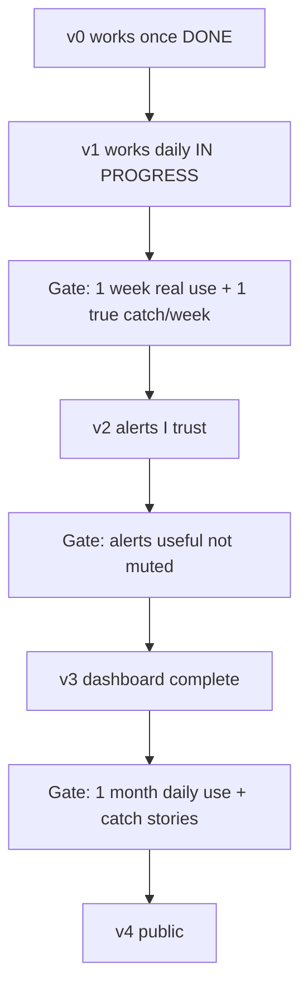

# Kizuki roadmap (v2–v4)

Sequenced build order for milestones after v1. North-star product context lives
in `docs/vision.md`; monetization / TEE / team product in `docs/future-notes.md`
— neither is build order. Ideation without a milestone home goes in
`docs/BACKLOG.md`.

## Milestone ladder

```
v0 works once (DONE 2026-07-04)
  → v1 works daily at work (IN PROGRESS)
  → v2 alerts I trust
  → v3 dashboard complete
  → v4 public
```



Each gate is an **evidence checkpoint**, not a feature. Record pass/fail in a
local journal (e.g. a note under `days/` or a private doc) — not in git. Track
gate evidence with `kizuki catch` / `kizuki gate` (spec:
`docs/superpowers/specs/2026-07-13-kizuki-gate-instrumentation-design.md`).

| Gate | Pass criteria |
|------|---------------|
| v1 → v2 | One week of real `./kizuki start`/`stop` use; analysis surfaces ≥1 thing per week you would have missed. |
| v2 → v3 | ≥1 alert per week you acted on; macOS notifications are useful, not muted. |
| v3 → v4 | One month of daily use; ≥3 anonymized catch stories documented for the landing page. |
| v4 exit | At least one external user completes init + first sync without hand-holding. |

---

## Shipped baseline (do not re-build)

These are done. New work builds on top of them.

| Area | Location |
|------|----------|
| Core pipeline | `lib/run.mjs`, `lib/payload.mjs`, `lib/apply.mjs`, `lib/vault.mjs` |
| Shift rituals | `kizuki` `start`/`stop`, `lib/shift.mjs`, `lib/launchd.mjs` |
| Safety | Write lock (`lib/lock.mjs`), append-only signal and insight ledgers (`lib/signals.mjs`, `lib/insights.mjs`), payload versioning, evidence guard (`lib/prompt.mjs`), agent timeout (`lib/agent.mjs`) |
| Tooling | `lib/doctor.mjs`, MCP (`mcp/`) |
| Dashboard (partial v3) | Next.js read-only UI (`web/`) — built ahead of the v2 gate per `docs/superpowers/specs/2026-07-06-kizuki-web-dashboard-design.md` |

**Open v1 validation (not code):** run the v1 → v2 gate above before starting v2
implementation. Track gate evidence with `kizuki catch` / `kizuki gate` (spec:
`docs/superpowers/specs/2026-07-13-kizuki-gate-instrumentation-design.md`).

---

## v2 — Proactive alerts

**Status:** code shipped 2026-07-07. Exit gate (alerts trusted in daily use) still open.

**Goal:** Surface high-signal alignment events (contradictions, blockers, mentions,
slipped deadlines) outside the per-entity follow-up firehose; notify on macOS for
warn/critical.

**Design spec:** `docs/superpowers/specs/2026-07-07-kizuki-alerts-design.md`

The scope below records the original v2 alert implementation. The signal
lifecycle upgrade shipped on 2026-07-09 and now owns current behavior. See
`docs/superpowers/specs/2026-07-09-kizuki-signal-lifecycle-design.md`.

**Gate to start:** v1 validation gate passed.

### Scope

1. **Payload contract** — extend `PAYLOAD_SHAPE` (`lib/prompt.mjs`) and
   `parsePayload` (`lib/payload.mjs`):
   - Top-level `alerts: []` (optional; default `[]`)
   - Fields: `severity`, `kind`, entity `type` + `name`, `evidence`, optional
     `draft`
   - Enums validated loudly; entity names path-safe (same rules as entities)
   - Bump `PAYLOAD_VERSION` to `2`

2. **`lib/alerts.mjs`** (new, zero-dep, TDD):
   - `appendAlerts(vaultDir, alerts, { now })` → `alerts/YYYY-MM-DD.md`
   - Exact full-line dedup (same invariant as `appendLog` in `lib/vault.mjs`)
   - Returns only newly appended alerts (for notification batching)
   - Called from `applyPayload` inside the existing write lock

3. **Notifications** — `lib/notify.mjs` (darwin-only; no-op elsewhere):
   - `notifyAlerts(newAlerts)` — osascript for `warn` / `critical`
   - `notifySyncFailing()` — after 2 consecutive `--loop` failures
   - Failure tracking via `state/sync-failures.json` or tail of `state/sync.log`

4. **Prompt** — extend `buildPrompt` rules for contradiction, blocker,
   mention-needing-reply, slipped deadline; alerts must cite evidence

5. **Wire** — `runSync` / `kizuki`: after `applyPayload` (not dry-run), append
   alerts + notify; `--loop` path tracks consecutive failures

6. **Tests** — `lib/alerts.test.mjs`, `lib/notify.test.mjs`; extend payload,
   apply, run tests

7. **`.gitignore`** — add `alerts/` (machine-local, same pattern as `days/`)

**Gate to exit:** v2 → v3 gate above.

**Out of scope:** dashboard alert feed (v3), Slack DM mirror (unranked), LLM day
summary (unranked).

### Signal lifecycle upgrade

Payload version 3 adds stable topics and source receipts. Deterministic code
maps each candidate to a signal ID and stores observation and status events in
gitignored `signals/events.jsonl`.

The event ledger is canonical. `alerts/YYYY-MM-DD.md` remains a compatibility
view for the shipped dashboard and macOS notifications. The CLI lists active or
terminal states, records manual lifecycle feedback, and imports old daily alert
files as resolved history. Migration runs only when the operator requests it.

### Explicit insight capture

Shipped 2026-07-09. A connected Codex or Cursor chat can respond to "Kizuki
this" by distilling one decision, learning, hypothesis, or question through the
`capture_insight` MCP tool. Kizuki never scans chat sessions or stores full
conversations.

Deterministic code validates the capture and appends it to the gitignored
`insights/events.jsonl` ledger. Active insights are immediately searchable and
can inform scoped sync/check prompts without becoming signal evidence. CLI and
MCP controls list, read, and archive captures. See
`docs/superpowers/specs/2026-07-09-kizuki-insight-capture-design.md`.

---

## v3 — Dashboard complete

**Status:** shipped 2026-07-07 (code). Exit gate (daily use + catch stories) still open.

**Goal:** Finish the interactive dashboard layer on the existing Next.js
subpackage. Do **not** build a parallel zero-dep `kizuki serve` server — the
original backlog sketch was superseded by
`docs/superpowers/specs/2026-07-06-kizuki-web-dashboard-design.md`.

**Gate to start:** v2 exit gate passed.

### Already shipped

- Entity browser, follow-ups, day summaries, search
- Auto-refresh, last-vault-update (`web/app/auto-refresh.tsx`, `web/lib/data.mjs`)
- Alert feed (`/alerts`), shift status + copy queue (`/shift`), brand restyle (`docs/BRAND.md` → `web/app/globals.css`)

### Remaining (validation only)

| Item | Status |
|------|--------|
| Approve/copy queue in daily use | Copy buttons shipped; validate hand-off to host agent |
| Catch stories for landing page | Human-authored content for v4 gate |

**Gate to exit:** v3 → v4 gate above; alert feed in daily use; approve-copy flow
defined (minimal: copy + link to Codex prompt is enough).

---

## v4 — Public

**Status:** code shipped 2026-07-07 (init, landing, skills installer). Exit gate (external user) still open.

**Goal:** Others can discover, install, and run Kizuki locally. No hosted or TEE
product (`docs/future-notes.md` gates that separately).

**Gate to start:** v3 → v4 gate above.

### Scope (shipped)

1. **Landing page** — `web/app/(landing)/landing/page.tsx`, host-routed via `web/proxy.ts`: vision one-liner + positioning copy
2. **`kizuki init`** — vault dirs, `kizuki.config.json` template, MCP snippet, doctor hint
3. **Distribution** — `package.json` `bin`, README polish
4. **Agent Skills pack** — `scripts/install-codex-prompts.mjs` copies `codex/prompts/`

### Remaining (validation / marketing)

1. Public GitHub polish, Show HN / Product Hunt (human)
2. Positioning pass with real catch stories
3. External user completes init + first sync without hand-holding (exit gate)

**Out of scope:** TEE hosting, team/multiplayer, RBAC, SSO, pricing implementation.

**Gate to exit:** v4 exit gate above.

---

## Unranked appendix

Park here until promoted into a milestone. See also `docs/BACKLOG.md`.

| Idea | Notes |
|------|-------|
| `--project` / `--team` CLI scope | **Shipped** — `lib/args.mjs` + prompt scope lines |
| Transcript watcher | **Shipped** — `kizuki watch` + `lib/watcher.mjs` |
| Cross-shift trends | **Shipped** — `lib/trends.mjs`; brief + dashboard home |
| LLM-written day summary | **Shipped** — prose synthesis prepended to `days/` file at `stop` (`lib/shift.mjs`); facts-only fallback |
| Slack DM mirror for alerts | Work IT permitting |
| Windows/Linux shift support | `lib/launchd.mjs` seam exists; needs schtasks/systemd |
| Vercel eve hosted runtime | Full multi-user runtime still blocked on data-safety. **Public demo shipped** — `web/demo-vault/` + `KIZUKI_DEMO` deploys the read-only dashboard on synthetic data (no real data can reach a build) |
| TEE / confidential enterprise | Post-v4; see `docs/future-notes.md` |

**Shipped (removed from active backlog):** vault write-lock (`lib/lock.mjs`).
