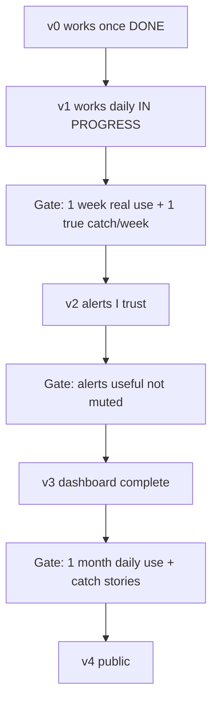

# Kizuki roadmap (v2–v4)

Sequenced build order for milestones after v1. North-star product context lives
in `docs/vision.md`; monetization / TEE / team product in `docs/future-notes.md`
— neither is build order. Ideation without a milestone home goes in
`docs/BACKLOG.md`.

## Milestone ladder

```
v0 works once (DONE 2026-07-04)
  → v1 works daily at work (IN PROGRESS)
  → v2 alerts I trust
  → v3 dashboard complete
  → v4 public
```



Each gate is an **evidence checkpoint**, not a feature. Record pass/fail in a
local journal (e.g. a note under `days/` or a private doc) — not in git.

| Gate | Pass criteria |
|------|---------------|
| v1 → v2 | One week of real `./kizuki start`/`stop` use; analysis surfaces ≥1 thing per week you would have missed. |
| v2 → v3 | ≥1 alert per week you acted on; macOS notifications are useful, not muted. |
| v3 → v4 | One month of daily use; ≥3 anonymized catch stories documented for the landing page. |
| v4 exit | At least one external user completes init + first sync without hand-holding. |

---

## Shipped baseline (do not re-build)

These are done. New work builds on top of them.

| Area | Location |
|------|----------|
| Core pipeline | `lib/run.mjs`, `lib/payload.mjs`, `lib/apply.mjs`, `lib/vault.mjs` |
| Shift rituals | `kizuki` `start`/`stop`, `lib/shift.mjs`, `lib/launchd.mjs` |
| Safety | Write lock (`lib/lock.mjs`), payload versioning, evidence guard (`lib/prompt.mjs`), agent timeout (`lib/agent.mjs`) |
| Tooling | `lib/doctor.mjs`, MCP (`mcp/`) |
| Dashboard (partial v3) | Next.js read-only UI (`web/`) — built ahead of the v2 gate per `docs/superpowers/specs/2026-07-06-kizuki-web-dashboard-design.md` |

**Open v1 validation (not code):** run the v1 → v2 gate above before starting v2
implementation.

---

## v2 — Proactive alerts

**Status:** code shipped 2026-07-07. Exit gate (alerts trusted in daily use) still open.

**Goal:** Surface high-signal alignment events (contradictions, blockers, mentions,
slipped deadlines) outside the per-entity follow-up firehose; notify on macOS for
warn/critical.

**Design spec:** `docs/superpowers/specs/2026-07-07-kizuki-alerts-design.md`

**Gate to start:** v1 validation gate passed.

### Scope

1. **Payload contract** — extend `PAYLOAD_SHAPE` (`lib/prompt.mjs`) and
   `parsePayload` (`lib/payload.mjs`):
   - Top-level `alerts: []` (optional; default `[]`)
   - Fields: `severity`, `kind`, entity `type` + `name`, `evidence`, optional
     `draft`
   - Enums validated loudly; entity names path-safe (same rules as entities)
   - Bump `PAYLOAD_VERSION` to `2`

2. **`lib/alerts.mjs`** (new, zero-dep, TDD):
   - `appendAlerts(vaultDir, alerts, { now })` → `alerts/YYYY-MM-DD.md`
   - Exact full-line dedup (same invariant as `appendLog` in `lib/vault.mjs`)
   - Returns only newly appended alerts (for notification batching)
   - Called from `applyPayload` inside the existing write lock

3. **Notifications** — `lib/notify.mjs` (darwin-only; no-op elsewhere):
   - `notifyAlerts(newAlerts)` — osascript for `warn` / `critical`
   - `notifySyncFailing()` — after 2 consecutive `--loop` failures
   - Failure tracking via `state/sync-failures.json` or tail of `state/sync.log`

4. **Prompt** — extend `buildPrompt` rules for contradiction, blocker,
   mention-needing-reply, slipped deadline; alerts must cite evidence

5. **Wire** — `runSync` / `kizuki`: after `applyPayload` (not dry-run), append
   alerts + notify; `--loop` path tracks consecutive failures

6. **Tests** — `lib/alerts.test.mjs`, `lib/notify.test.mjs`; extend payload,
   apply, run tests

7. **`.gitignore`** — add `alerts/` (machine-local, same pattern as `days/`)

**Gate to exit:** v2 → v3 gate above.

**Out of scope:** dashboard alert feed (v3), Slack DM mirror (unranked), LLM day
summary (unranked).

---

## v3 — Dashboard complete

**Goal:** Finish the interactive dashboard layer on the existing Next.js
subpackage. Do **not** build a parallel zero-dep `kizuki serve` server — the
original backlog sketch was superseded by
`docs/superpowers/specs/2026-07-06-kizuki-web-dashboard-design.md`.

**Gate to start:** v2 exit gate passed.

### Already shipped

- Entity browser, follow-ups, day summaries, search
- Auto-refresh, last-vault-update (`web/app/auto-refresh.tsx`, `web/lib/data.mjs`)

### Remaining

| Item | Approach | Observe-and-advise |
|------|----------|-------------------|
| Alert feed | `/alerts` page reading `alerts/YYYY-MM-DD.md` via `web/lib/data.mjs` | Read-only |
| Shift status | Read-only display of `state/shift.json` + CLI instructions; subprocess start/stop from web needs a separate design decision | No autonomous actions |
| Approve/copy queue | Copy button + hand-off to host-agent chat; never send from Kizuki | Deferred detail in dashboard-polish spec |
| Brand restyle | Apply `docs/BRAND.md` tokens to `web/app/globals.css` | Cosmetic |

**Gate to exit:** v3 → v4 gate above; alert feed in daily use; approve-copy flow
defined (minimal: copy + link to Codex prompt is enough).

---

## v4 — Public

**Goal:** Others can discover, install, and run Kizuki locally. No hosted or TEE
product (`docs/future-notes.md` gates that separately).

**Gate to start:** v3 → v4 gate above.

### Scope

1. **Landing page** — extend `site/index.html` or new public site: one-liner from
   `docs/vision.md` + anonymized catch stories
2. **`npx kizuki init`** — setup wizard: vault dirs, `kizuki.config.json`
   template, MCP registration snippet, `doctor` smoke path
3. **Distribution** — public GitHub (code only; vault data stays gitignored),
   README polish, optional Show HN / Product Hunt
4. **Positioning pass** — narrow alignment wedge vs horizontal org search
5. **Agent Skills pack** (optional) — `codex/prompts/` as installable skills

**Out of scope:** TEE hosting, team/multiplayer, RBAC, SSO, pricing implementation.

**Gate to exit:** v4 exit gate above.

---

## Unranked appendix

Park here until promoted into a milestone. See also `docs/BACKLOG.md`.

| Idea | Notes |
|------|-------|
| `--project` / `--team` CLI scope | `lib/args.mjs` accepts person positional only today |
| Transcript watcher | Auto-sync when a file lands in `transcripts/` |
| Cross-shift trends | e.g. "inbound data blocked 3 days running" |
| LLM-written day summary | Deterministic aggregate exists in v1 |
| Slack DM mirror for alerts | Work IT permitting |
| Windows/Linux shift support | `lib/launchd.mjs` seam exists; needs schtasks/systemd |
| Vercel eve hosted runtime | Blocked on data-safety story; local-first for personal/work |
| TEE / confidential enterprise | Post-v4; see `docs/future-notes.md` |

**Shipped (removed from active backlog):** vault write-lock (`lib/lock.mjs`).
