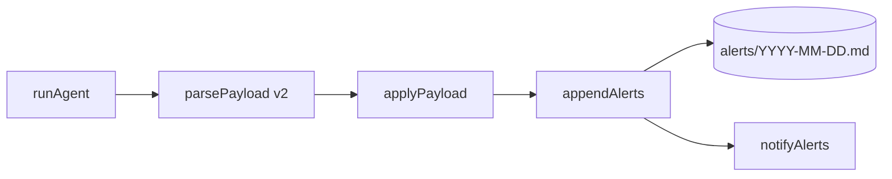

# Kizuki proactive alerts (v2) — design

Date: 2026-07-07
Status: approved

Roadmap: `docs/ROADMAP.md` (v2). Implementation plan to follow in
`docs/superpowers/plans/` when v1 validation gate passes.

## What

Sync runs can emit **alerts** — high-signal alignment events separate from
per-entity follow-ups — persisted to `alerts/YYYY-MM-DD.md` and surfaced via
macOS notifications for `warn` and `critical` severities. This is the vision
wedge (cross-team contradiction, blocker, mention, slipped deadline) as a
first-class output channel.

Kizuki still observes and advises only. Notifications and alert files are
read-only surfaces for the operator; nothing is sent automatically.

## Decisions

- **Alerts live in the agent payload**, same boundary as entities: the LLM
  proposes; deterministic JS writes. Bump `PAYLOAD_VERSION` to `2` when
  `alerts` ships.
- **Exact full-line dedup** when appending to the daily alert file — same
  invariant as `appendLog` in `lib/vault.mjs`. Re-runs must not duplicate
  identical alert lines.
- **`appendAlerts` returns only new lines** so `lib/notify.mjs` can batch
  osascript calls for alerts that were actually appended this sync.
- **Severity drives notification:** only `warn` and `critical` trigger
  macOS notification; `info` is file-only.
- **Failure counter for background sync:** track consecutive `--loop` failures
  in `state/sync-failures.json` (reset on success). Notify once when count
  reaches 2. Existing `state/sync.log` append-on-failure behavior is kept.
- **`lib/notify.mjs` is darwin-only;** no-op on other platforms (same pattern
  as `lib/launchd.mjs` non-darwin behavior).
- **`alerts/` is gitignored** — machine-local work data, same as `days/` and
  `state/`.

## Payload schema (version 2)

Top-level shape (extends v1):

```json
{
  "version": 2,
  "entities": [],
  "consumedTranscripts": [],
  "alerts": [
    {
      "severity": "info",
      "kind": "contradiction",
      "type": "project",
      "name": "staff",
      "evidence": "Team A Jira says UAT July 10; Team B standup transcript says July 17.",
      "draft": "Hi both — can we align on the inbound UAT date? Jira shows July 10 but today's standup had July 17."
    }
  ]
}
```

### Field rules

| Field | Required | Values / rules |
|-------|----------|----------------|
| `severity` | yes | `"info"` \| `"warn"` \| `"critical"` |
| `kind` | yes | `"contradiction"` \| `"blocker"` \| `"mention"` \| `"deadline"` |
| `type` | yes | `"person"` \| `"project"` \| `"team"` |
| `name` | yes | kebab-case; path-safe (no `/`, `\`, `..`) |
| `evidence` | yes | non-empty string; one-line citation of what was seen |
| `draft` | no | copy-paste-ready action text when useful |

- Missing `alerts` key → treat as `[]` (back-compat within v2).
- Invalid enum, missing required field, or unsafe name → throw loudly in
  `parsePayload` before any write.
- Alerts must be directly evidenced in transcript files or named MCP sources —
  same evidence guard as entities (`lib/prompt.mjs`).

### Kind semantics (prompt guidance)

| Kind | Detect when |
|------|-------------|
| `contradiction` | Two sources or teams imply different facts about the same decision, date, or scope |
| `blocker` | Work is stuck on a dependency, access, or approval with no owner action visible |
| `mention` | Someone was @-mentioned or assigned and a reply or ack is still missing |
| `deadline` | A committed date slipped or is at risk with downstream impact |

## Alert file format

Path: `alerts/YYYY-MM-DD.md` (UTC date from sync `now`, same convention as
`days/`).

Each alert renders as one markdown list line:

```
- **[critical] contradiction** project/staff: Team A Jira says UAT July 10; Team B standup transcript says July 17.
```

Optional draft on the next line, indented:

```
  ```
  Hi both — can we align on the inbound UAT date?
  ```
```

Dedup key: the **exact full line** of the list item (the `- **[severity] kind** ...`
line only, not including draft fences). A new alert whose line matches an
existing line in the file is skipped.

## Architecture



- **`lib/alerts.mjs`** — `formatAlertLine(alert)`, `appendAlerts(vaultDir, alerts, { now })`
- **`lib/notify.mjs`** — `notifyAlerts(newAlerts)`, `notifySyncFailing()`, injectable
  `runOsascript` for tests
- **`lib/apply.mjs`** — after entity writes, call `appendAlerts`; return
  `{ changes, newAlerts }` or extend return shape consumed by `runSync`
- **`lib/run.mjs`** — if not dry-run, pass `newAlerts` to notify
- **`kizuki`** `--loop` branch — increment/reset `state/sync-failures.json`;
  call `notifySyncFailing()` at 2

Prompt changes in `lib/prompt.mjs`: add example alert to `PAYLOAD_SHAPE`;
add rules for when to emit alerts vs entity follow-ups (alerts = cross-cutting
or urgent; entity follow-ups = per-person/project/team todos).

## Error handling

- Parser rejects bad alerts before any filesystem write (same as entities).
- osascript failure: log to stderr; do not fail the sync (notification is
  best-effort).
- `appendAlerts` runs inside existing `withVaultLock` in `applyPayload`.

## Testing

- **`lib/alerts.test.mjs`**
  - `formatAlertLine` output shape
  - `appendAlerts` creates file, appends new lines
  - exact-line dedup: duplicate alert skipped; prefix of existing line still appends
  - returns only newly appended alerts
  - date file naming from injected `now`
- **`lib/notify.test.mjs`**
  - `notifyAlerts` calls osascript for warn/critical only
  - skips info
  - no-op on non-darwin (or when `runOsascript` stubbed)
  - `notifySyncFailing` message shape
- **`lib/payload.test.mjs`** — extend for v2 alerts validation (enums, path-safe name, missing optional draft)
- **`lib/apply.test.mjs`** — alerts appended on apply; dedup on re-run
- **`lib/run.test.mjs`** — notify called with new alerts when not dry-run
- **`kizuki` / loop** — failure counter increments, resets, notifies at 2 (unit test via extracted helper if needed)

## Non-goals (v2)

- Dashboard alert feed (`web/` — v3)
- Slack DM mirror (unranked backlog)
- Alert dismissal / ack state
- Multi-version payload parsing (only v2 when shipped; v1 payloads without
  `alerts` remain valid if version is 1 — see migration note below)

## Migration note

When v2 ships, `PAYLOAD_VERSION` becomes `2`. Payloads with `"version": 1`
continue to parse (no `alerts` field). Payloads with `"version": 2` require
valid `alerts` array (may be empty). Any other version throws loudly.

## Invariants preserved

- LLM never writes files directly.
- Single-writer rule via `state/vault.lock`.
- Observe-and-advise: notifications surface text; user acts.
